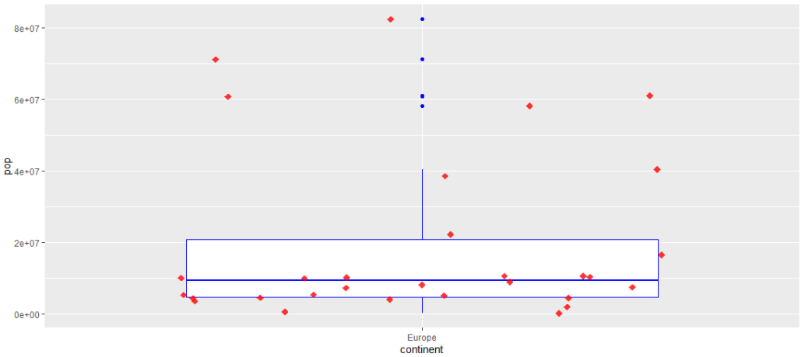

<h1 style ='color:black; font-size: 50px; font-weight:bold'> Session 2: R </h1>


<hr>

<p> In this session we will be exploring R, a computing language which has been optimised for statistical analysis and machine learning. While it does not have the range of functionality Python has, it more than makes up for it with the suite of packages it has for data manipulation, analysis and visualisation. 

This notebook will cover the basics of R, exploratory data analysis and visualisations. <p>

<a id="outline"></a>

## Session Outline

- [Features of R](#features_of_r)
- [Control Flow in R](#control-flow-in-R)
- [Exploratory Data Analysis in R](#exploratory-data-analysis-in-R)
- [Visualisation in R](#visualisation-in-R)
- [Linear Modelling in R](#linear-modelling-in-R)
- [RStudio](#rstudio)
- [Recap](#recap)

## Learning Objectives

- Understand the Basics of R
- Compare and Contrast the functions of R with Python
- Utilise R to perform Data Analytics

<hr>


<a id="features_of_r"></a>

<div class='image' style='width:100%;height:100%'>
    
    <h2 style ='color:#f4f4f4; font-size: 70px; font-weight:bold; position:absolute; top:150px; left:200px; width:90%'> Features of R </h2>
</div>

<a href=#outline> Top </a>

<p><b>Aim:</b> Understand the Basic Features of R </p>


R is a statistical language realeased in 1995 by Ross Ihaka and Robert Gentleman at the University of Auckland. It was named after the first letter of both author's names, and as a play on S, the computing language R was built upon. R is mostly used for statistical computation and analysis but has also gained attention for developing machine learning products. Like Python, R's statistical computing capabilities can be extended with packages. R is also an object orientated language (OOP) but is not as intuitive as python. However, the wide range of statistical tests and the ease of building visualisations makes R a favourite of statisticians across the globe. 

<h1> Packages </h1>

R packages are collections of functions that allow for reusability, modularity and building cleaner code through extending R capabilities. Packages are stored in repositories called <b>C</b>omprehensive <b>R</b> <b>A</b>rchive <b>N</b>etworks or CRANs. As with Python, R is open source meaning anyone can write packages and you can install any package available in a CRAN. 

A script in R is a text file with extension `.R` where you can write your code and save anywhere.

### Data Types in R

The table below shows the different data types in R and what their python equivalents are.

<table style=" width:100%">
    <tr>
        <th style="text-align:left; font-size:15px"><b>Data Type (R)</b></th>
    <th style="text-align:left; font-size:15px"><b>Python Equivalent</b></th>
    <th style="text-align:left; font-size:15px"><b>Example</b></th>
</tr>
<tr>
    <td style="text-align:left">Character</td> 
    <td style="text-align:left">String</td>
    <td style="text-align:left">'A', 'MultiVerse', 'a123abc'</td> 
    
</tr>
<tr>
    <td style="text-align:left">Integer</td>
    <td style="text-align:left">Integer</td>
    <td style="text-align:left">3, 7, 102</td>
    
</tr>

<tr>
    <td style="text-align:left">Numeric</td>
    <td style="text-align:left">Float</td>
    <td style="text-align:left">10.5, 3.14, 2.3</td>
    
</tr>
<tr>
    <td style="text-align:left">Logical</td>
    <td style="text-align:left">Boolean</td>
    <td style="text-align:left">TRUE, FALSE</td>
    
</tr>
<tr>
    <td style="text-align:left">NA</td>
    <td style="text-align:left">NaN</td>
    <td style="text-align:left"></td>
    
</tr>
    
    
<tr style="border: none">

</tr>

</table>

Note that for logical data types they are all capitalised as opposed to python where only the first letter is uppercase.

If you are ever stuck in R, remember there is the `help()` function to bring up the documentation. Otherwise, stackoverflow has plenty of solutions to common problems.

## Declaring Variables in R

### For a single variable

```{r}
x <- 'my variable' 
```

Traditionally we use `<-` to assign a variable, but `=` works just as well.

```{r}
x = 'my variable'
```

Like python, R has a print function to see what is stored in a variable.

```{r}
print(x)
```

Or we could just call the variable name itself to see what is stored...

```{r}
x
```

We can also call a collection of integers

```{r}
y <- 2:6
y
```

You can check the datatype of a variable by using the command `typeof()`

```{r}
typeof(y)
```

```{r}
# We can add comments in R the same way we do in Python
```

```{r}
'But there are
other methods of doing it too, 
which let you put it over multiple lines
but hashtag is best practice
so please dont use this'
```

### Mathematical Operators

Like python, R has a range of in built operators

```{r}
1 + 1
```

```{r}
10-15
```

```{r}
5 * 6
```

```{r}
2 ** 5
```

```{r}
10 %% 3 #Modulo
```

```{r}
10/5
```

```{r}
sqrt(25)
```

```{r}
mean(c(3,5,6))
```

```{r}
mean(4:6)
```

```{r}
median(4:6)
```

## Data Structures in R

Like in python there exist data structures we use to store our data for analyis.


### 1)<b> List:</b>  
A collection of elements that can hold a combination of data types. Note, a list is also similar to a dictionary in python
  

```{r}
l <- list('a'=1, 'b'=2,'c'=3)
l
```

If I want to call an element from a list I need to use the `$` notation and reference the tag.

```{r}
l$a
```

Lists do not require tags to be called however.

```{r}
l2 <- list(1,'some text',3, TRUE)
l2
```

We can reference elements from a list by using their key. Lists in R are more similar to dictionaries in python.

```{r}
l2[4]
```

```{r}
l2[4]
```

```{r}
l['a']
```

If I want to retrieve this value for further use I need to use `[[]]`

```{r}
l2[[4]]
```

```{r}
l[['a']]
```

To add items to a list you need to call the tag of where you want it to be placed and assign it the value you want. 

```{r}
l[['d']] <- 'Multiverse'
l
```

Editing a value in a list follows the same format.

```{r}
l[['a']] <- 20
l
```

To delete an item you assign the tag the value `NULL`.

```{r}
l[['b']] <- NULL; l #The semi-colon allows us to put multiple commands in the same line, though we do not recommend doing this
```

Note, we can use `str()` to find the types of variables in a structure

```{r}
str(l)
```

### 2) Vectors:

A collection of elements of the <b>same data type</b>, similar to numpy arrays

We use `c()` to define a vector

```{r}
numbers <- c(1,2,3,8)
numbers
```

```{r}
str(numbers)
```

To edit, append or view values from a vector you just use the same notation as a list. Note that vectors are not zero indexed.

```{r}
numbers[4]
```

```{r}
numbers[c(1,4)] #access several elements
```

```{r}
numbers[1]= 5
numbers
```

```{r}
numbers[5]=10
numbers
```

We can make it more like a dictionary and apply tags to the values.

```{r}
l
```

```{r}
more_numbers <- c('first'=1, 'second'=2, 'third'=3)
more_numbers
```

```{r}
more_numbers['first']
```

```{r}
more_numbers[['first']]
```

#### What is the difference between a list and a vector?

```{r}
# A:
```

Click here for solution

<span style ='color:white'>

All elements in a vector must be of the same data type, lists can have a variety. Run the two lines below and see what happens to the vector.
    
list_ex <- list(1,'a', 4)
vector_ex <- c(1, 'a', 4)
    
Because one element is a character, all of them are converted to characters.

### 3) Matrices:

A table like structure with rows and columns (an extension of a vector)

```{r}
X <- matrix(nrow=2,ncol=3)
print(X) # An empty matrix
```

```{r}
X <- matrix(c(2,3,5,3,4,2),nrow=2,ncol=3)
print(X)
```

```{r}
str(X)
```

To add a column to a matrix we use `cbind()`

```{r}
X2 <- cbind(X,c(4,5))
print(X2)
```

To add a row to a matrix we use `rbind()`

```{r}
X3 <- rbind(X,c(34,2,1))
print(X3)
```

### 4) DataFrames:

A tabular data structure to perform statistical operations. Other than vectors, dataframes will likely be the most used data structure in data manipulation and analysis

```{r}
df <- data.frame(one=c(1:5), two=c('A','B','C','D','E'))
print(df)
```

```{r}
df
```

```{r}
str(df)
```

```{r}
df$one
```

```{r}
df['one']
```

```{r}
df[['one']]
```

Adding rows and columns is the same as a matrix

```{r}
df <- rbind(df,data.frame(one=6,two='F'))
df
```

```{r}
df <- cbind(df,data.frame(three=c(TRUE, FALSE, FALSE, TRUE, TRUE, FALSE)))
df
```

Or we can add columns by using the `$` notation.

```{r}
df$four= c('R','R','Python','Python','Python','R')
df
```

To delete a column, the simplest method is to create a `subset()` and select which rows you want to drop using `-c()`

```{r}
subset(df,select=-c(two)) # Dataframe output. Needs to be reassigned to df for the value to hold.

# OR the following gives you a vector output
df[,-c(2)]

# OR for a more permanent change...
df$two <- NULL
```

To delete a row, you reference the dataframe by calling the complement of the rows you <b> do not </b> want by using `-c()`

```{r}
df[-c(5),]
```

Remember to reassign the dataframe to your variable name or your deletions won't actually hold!

## Exercise

Create the following:

<ol>
    <li> A variable to store your name </li>
    <li> A variable to store a vector from 1 to 10 </li>
    <li> A variable to store a vector showing your name, age, city and if your OTJ is above 100% (True or False) </li>
    <li> A variable to store a dataframe with three columns: name, age and city for 5 people 
</ol>

```{r}
# A:
```

<hr>

<a id="control-flow-in-R"></a>

<div class='image' style='position:relative;width:100%;height:60%'>
    
    <h2 style ='color:#f4f4f4; font-size: 70px; font-weight:bold; position:absolute; top:150px; left:200px; width:90%'> Control Flow in R </h2>
</div>
<br>


[Top](#outline)

<p><b>Aim:</b> Understand how to set up loops and functions in R </p>

Like with Python, R allows you to write loops which you can use to parse data or generate new data structures for your analysis. 

## Logic Statements

In python these were denoted by `if` followed by some logical statement e.g. `if x==2:`

R allows you to do these as well, although the logic statements are the same, the syntax for calling the statement is different

<table style=" width:100%">
    <tr>
        <th style="text-align:left; font-size:15px"><b>Operator</b></th>
        <th style="text-align:left; font-size:15px"><b>Meaning</b></th>
    </tr>
    <tr>
        <td style="text-align:left">==</td> 
        <td style="text-align:left">Equals</td>
    </tr>
    <tr>
        <td style="text-align:left">!=</td>
        <td style="text-align:left">Not Equals</td>
    </tr>
    <tr>
        <td style="text-align:left">></td>
        <td style="text-align:left">Greater Than</td>
    </tr>
    <tr>
        <td style="text-align:left">>=</td>
        <td style="text-align:left">Greater Than or Equals To</td>
    </tr>
    <tr>
        <td style="text-align:left"><</td>
        <td style="text-align:left">Less Than</td>
    </tr>
    <tr>
        <td style="text-align:left"><=</td>
        <td style="text-align:left">Lesser Than or Equals To</td>
    </tr>
    <tr>
        <td style="text-align:left">%in%</td>
        <td style="text-align:left">Is in</td>
    </tr>
    <tr style="border: none">
    </tr>
</table>

```{r}
# This is Python code; it won't run in R
# value = 10
# if value > 5:
#    print('something')
```

```{r}
value <- 10

if (value > 5){
    print('Greater than 5')
}
 
```

Adding in an else statement is simple, just place it after the brackets are closed.

```{r}
value <- 4

if (value > 5){
    print('Greater than 5')
} else {
    print('Less than or equal to 5')
}
```

To add multiple conditions you just need to use else if.

```{r}
value <- 5

if (value > 10){
    print('Greater than 10')
} else if (value == 5) {
    print('Equals 5')
} else {
    print('Not 5 and less than or equal to 10')
}
```

We can also add in multiple conditions. This is the same as python with `|` representing or and `&` meaning and.

```{r}
value <- 7

if (value > 5 & value < 10){
    print(' Value between 5 and 10')
}
```

```{r}
value <- 2

if (value > 5 | value == 2){
    print(' Value is 2 or greater than 5')
}
```

An advantage of R is that you can write entire blocks of code in one line, just ensure you have closed off the previous statement. Again, we don't recommend this as it isn't particularly readable.

```{r}
if (value > 10) {print('value greater than 10')} else {print('value less than 10')}
```

## For Loops

Now we know how to build in a logical statement we can add these into for loops. In this example we will loop through a vector of names and use the `paste()` command to create a string insert.

```{r}
names <-  c('John','Jack','Andrew','Joseph','Laura','Grace','Rohit','Haydeh')
```

```{r}
for (name in names){
    print(paste("Hi", name))
}
```

It is simple to add in a logical statement to our loop, for example if we wanted to check if a name had 4 letters in it. Note we use `nchar()` in R to check string length.

```{r}
for (name in names){
    if (nchar(name)==4){
        print(paste(name, " has 4 letters"))
    } else{
        print(paste(name, "does not have 4 letters"))
    }
}
```

## While Loops

The syntax is similar to before, always remember to add in your exit clause!

Remember, while loops are used when you don't know how many iterations you will need.

```{r}
n <- 20

while (n>0){
    print(paste('Five times ',n,' is ',n*5))
    n <- n-1
}
```

## Functions

Functions are useful ways of storing our code so we can use them again later. The process of building a function is simple and consists of defining the function and then writing what it does. For example, we can write a function that returns the square root of the difference of two squared numbers. 

```{r}
sqrt_squared_diff <- function(x,y){
    return(sqrt(abs(x**2-y**2)))
}
```

```{r}
sqrt_squared_diff(5,2)
```

## Exercise

<ol>
    <li> Write a loop which squares the numbers from 1 to 20 and prints the result </li>
    <li> Write a loop which takes 5 names and prints `TRUE` if the number of characters is greater than 7</li>
    <li> Write a loop that counts down from 20, `You have [number] seconds left`. When the number reaches 0 print a `Game Over` statement</li>
    <li> Write the game 'FizzBuzz' where if the number is a multiple of 3 it returns 'Fizz', 'Buzz' if it is a multiple of 5 and 'Fizzbuzz' if it is a multiple of both. If it is neither print the number, do this for the numbers from 1 to 100</li>
    <li> [Stretch] Write a function that simulates the game 'Rock, Paper, Scissors' you will need to look up R's random and user input functions. Note that your loop should check the player's input is valid. </li>
</ol>
    

```{r}
# A:
```

Click here for solutions

<span style ='color:white'>
    
#1 for (i in c(1:20)){
    print(i**2)
}
    
#2 for (name in c('Andrew','Clara','Alexia','Campbell','Olusegun')){
    if (nchar(name)>7){
        print (TRUE)
    } else {
        print (FALSE)
    }
}

#3 n <- 20

while (n >=0) {
    if (n>0){
        print(paste("You have ",n," seconds left"))
        n=n-1
    } else {
        print('Game Over')
        n=n-1
    }
}
    
#4 for (i in c(1:100)){
    if (i %% 5 == 0 & i %% 3==0){
        print('Fizzbuzz')
    } else if (i%%5==0){
        print('Fizz')
    } else if (i%%3==0){
        print('Buzz')
    } else{
        print(i)
    }
}
    
#5 
state=TRUE
while (state == TRUE){
    your_answer <- readline(prompt='Rock, Paper or Scissors: ')
    if (your_answer %in% c('Rock','Paper','Scissors')){    
    computer_answer <- sample(c('Rock', 'Paper', 'Scissors'),1)
    print(paste('Computer picked ',computer_answer))
    if (your_answer==computer_answer){
        print('Draw!')
        state=FALSE
    } else if ((your_answer=='Rock' & computer_answer=='Paper') | (your_answer=='Paper' & computer_answer=='Scissors')|(your_answer=='Scissors' & computer_answer=='Rock')){
        print('You Lose!')
        state=FALSE        
    } else {
        print('You win!')
        state=FALSE
    }
  } else {
        state=TRUE
    }
}
    

<hr>

<a id="exploratory-data-analysis-in-R"></a>
<div class='image' style='position:relative;width:100%;height:60%'>
    
    <h2 style ='color:#f4f4f4; font-size: 60px; font-weight:bold; position:absolute; top:150px; left:100px; width:90%'> Exploratory Data Analysis <br> in R </h2>
</div>
<br>


[Top](#outline)

<p><b>Aim:</b> Consider how to perform EDA in R <p>

<i>'80% of your time spent on a data project will be spent cleaning data, the rest will be spent analysing it'</i> - pretty much every data scientist and analyst ever.

We have seen time and time again throughout this course that EDA in an important and unskippable part of the data analytics life cycle. The principles in R are the same as with Python and Excel but the processes are different. We will now look at some common EDA tools you will use with R.

Much of the functionality of R is enhanced by functions and packages. Like in Python, some functions are not preinstalled so we use the command `install.packages` to build them in. Note, you only have to install a package once and from then any time you want to use it you just call the name of the package. 

For this lesson we will use tidyverse which includes everything you can see in this image:
<br>


<a href='https://t.co/D5d1988JUp?amp=1'>Cheatsheets</a> are amazing for overviews for specific packages.

```{r}
#For the first time

# install.packages("tidyverse")
```

```{r}
#Every time after
library(tidyverse)
library(dplyr)
```

We are now going to look through some common EDA commands you will use in your analysis.

```{r}
# Loading a data set
data <- read.csv('data/products.csv')

# Note different import functions exist for different data files
```

```{r}
# Check the head
tail(data)
```

```{r}
# Check summary statistics
summary(data)
```

```{r}
# For one column
summary(data$pack)
```

```{r}
# For one statistic
sd(data$pack)
```

```{r}
mean(data$pack)
```

```{r}
# Correlations
cor(data$proof,data$bottle_size)
```

## Common Functions

The following table shows the most common functions of tidyverse that you will use:

<table style=" width:100%">
    <tr>
        <th style="text-align:left; font-size:15px"><b>Function</b></th>
    <th style="text-align:left; font-size:15px"><b>What It Does</b></th>
   
</tr>
<tr>
    <td style="text-align:left">filter()</td> 
    <td style="text-align:left">Include (or exclude) certain rows</td>
  
</tr>
<tr>
    <td style="text-align:left">arrange()</td>
    <td style="text-align:left">Change the order of observations</td>

    
</tr>

<tr>
    <td style="text-align:left">select()</td>
    <td style="text-align:left">Include (or exclude) certain columns</td>

    
</tr>
<tr>
    <td style="text-align:left">mutate()</td>
    <td style="text-align:left">Create new columns</td>

    
</tr>
<tr>
    <td style="text-align:left">group_by()</td>
    <td style="text-align:left">Organise obervsations into groups</td>

    
</tr>
<tr>
    <td style="text-align:left">summarise()</td>
    <td style="text-align:left">Derive aggregate statistics for groups of observations</td>

    
</tr>

    
    
    
<tr style="border: none">

</tr>

</table>

```{r}
# Filter
filter(data,proof>40 )
```

```{r}
# More than one filter?
filter(data,proof==40,pack>10)
```

```{r}
# Arrange
arrange(data, vendor)
```

```{r}
# Change the order
arrange(data, desc(vendor))
```

```{r}
# This is a Python example
# data[data.bottle_size>10].sort_values(by='vendor')
```

```{r}
# Filter then arrange
arrange(filter(data,bottle_size>10), vendor)
```

## Piping

Using functions in R can be laborious if you want to apply more than one to your data as every new function needs to be wrapped around your statement (meaning it could get quite long). Instead we can use a technique called 'piping' which allows you to concatenate functions into a single statement using `%>%`.

Using the example from above:

```{r}
data %>% filter(bottle_size>10) %>% arrange(vendor)
```

```{r}
# This can be stored to a variable
d <- data %>% filter(bottle_size>10) %>% arrange(vendor)
```

Piping is a more intuitive way of writing your code as it starts with your data and then applies the functions.

The process can be summarised by:


## Slicing, Column Selection and Renaming

Note, that R is 1-indexed (unlike Python which is 0-indexed). Keep this in mind when slicing data. 

```{r}
data %>% slice(1:5)
data %>% slice(., 1:5)
```

Selecting a column is a simple as just saying what column you want:

```{r}
data %>% select(category_name,proof) %>% head()
```

When renaming a column notice that the new name comes first:

```{r}
data %>% rename(vendor_no=vendor) 
```

## Mutate, Group By and Summarise

Mutate allows you to update or create new columns:

```{r}
data %>% mutate( total_cost=as.integer(pack)*as.integer(case_cost)) 
```

If you want to change an existing column you just need to reference it as the column name in the mutate statement. Note for these changes to take effect I would need to assign the pipeline to a variable.

```{r}
data %>% mutate(vendor=vendor+1)
```

Summarise allows you to tuen many observations into a single datapoint. This is not to be confused with summary() which we saw earlier.

```{r}
mean(data$bottle_size)
```

```{r}
data %>% summarise(mean_bottle_size=mean(bottle_size))
```

Summarise is particularly powerful when combined with group_by which allows you to summarise within a group:

```{r}
data %>% group_by(category_name) %>% summarise(mean_bottle_size=mean(bottle_size)) %>% head()
```

## Exercise

### 1) Import gapminder data using `read_csv`

```{r}
gap_data <- read.csv('data/gapminder_data.csv')
```

```{r}
head(gap_data)
```

### Check the head, tail and summary statistics of your data

```{r}
# A:
```

Click here for solution

<span style ='color:white'>

head(gap_data)
tail(gap_data)
summary(gap_data)

### 3) Calculate the summary statistics for the `pop` column

```{r}
# A:
```

Click here for solution

<span style ='color:white'>
summary(gap_data$pop)

### 4) Filter the Dataset to only include data for `2007` and call it `gap_2007`

```{r}
# A:
```

Click here for solution

<span style ='color:white'>

gap_2007 <- gap_data %>% filter(year==2007)

### 5) Slice the first 20 rows of the data and call it `gap_20`

```{r}
# A:
```

Click here for solution

<span style ='color:white'>

gap_20 <- gap_data %>% slice(1:20)

### 6) Return the mean `gdpPercap` for each continent for 2007

```{r}
# A:
```

Click here for solution

<span style ='color:white'>
gap_data %>% filter(year==2007) %>% group_by(continent) %>% summarise(mean_gdpPercap_2007=mean(gdpPercap))

<hr>

<a id="visualisation-in-R"></a>
<div class='image' style='position:relative;width:100%;height:60%'>
    
    <h2 style ='color:#f4f4f4; font-size: 60px; font-weight:bold; position:absolute; top:150px; left:200px; width:90%'> Visualisation in R </h2>
</div>
<br>


[Top](#outline)

<p><b>Aim:</b> Build Visualisations in R <p>

We know from previous modules that visualisation is an important part of our exploratory data analysis. You have seen how to do it in Excel, Python and with a platform. For your portfolio it is important you show a range of skills and tehcniques so it is a good idea to consider how you can demonstrate some analysis using R, and visualisations are a good place to start. 

## Visualisation with `ggplot`

The main visualisation package we will use is ggplot which offers a wide variety of visualisations for you to choose from.


<a href='https://www.datanovia.com/en/blog/ggplot-examples-best-reference/'> Some other examples </a> 

The syntax for building a visualisation is `ggplot(data,aesthetics) + plot type`. Let's build a simple scatter graph from our gap_data to demonstrate:

```{r}
# To build a scatter graph we need to state the data source, what our x and y values are and what type of plot we want.
ggplot(data=gap_data,aes(x=lifeExp,y=pop)) + geom_point()
```

```{r}
gap_2007 <- gap_data %>% filter(year==2007)
```

```{r}
# If I wanted to colour by continent
ggplot(data=gap_2007,aes(x=lifeExp,y=pop,color=continent)) + geom_point()
```

```{r}
# To build a bar graph we change to geom_bar. In this example we are calculating the mean lifeExp per continent
ggplot(data=gap_data,aes(x=continent,y=lifeExp)) + geom_bar(stat='summary',fun='mean')
```

```{r}
# Boxplots
ggplot(data=gap_data,aes(x=continent,y=lifeExp)) + geom_boxplot()
```

We can also change things about our plots to make them more attractive, such as colours, titles and captions.

```{r}
ggplot(data=gap_data,aes(x=continent,y=lifeExp)) + 
    geom_bar(stat='summary',fun='mean',fill=c('#4d61f4','#242456','green','yellow','orange')) +
    labs(x='Continent',y='Mean Life Expectancy',title='Mean Life Expectancy per Continent') 
```

If we want to fit more than one visualisation on the page, we can use faceting to create subplots

```{r}
ggplot(data=gap_data,aes(x=lifeExp,y=pop,color=continent)) + geom_point() + facet_wrap(vars(continent))
```

Of course there are far more things you can do to build visualisations in R, more than we can show you in this session. Like Python, R has a well documented library to help you understand and build the visualisations you want.

## Exercise

<ol>
    <li> Plot the gdpPercap against lifeExp as a scatter plot using 2007 data </li>
    <li> Plot the gdpPercap against lifeEXP as a scatter plot, colour by continent using 2007 data </li>
    <li> Plot the gdpPercap against lifeExp as a scatter plot, colour by continent and size by pop using 2007 data (Hint: you can add the argument size to the aesthetics </li>
    <li> Make a line plot of the pop column for the United Kingdom (Hint: you will need geom_line() not geom_point())</li>
</ol>

```{r}
# A:
```

Click here for solutions
<span style ='color:white'>
    #1 ggplot(data = gap_2007, aes(x=gdpPercap,y=lifeExp))+
  geom_point()+
  labs(x='GDP per Capita',y='Life Expectancy')
    #2 ggplot(data = gap_2007, aes(x=gdpPercap,y=lifeExp,color=continent))+
  geom_point()+
  labs(x='GDP per Capita',y='Life Expectancy')
    #3 ggplot(data = gap_2007, aes(x=gdpPercap,y=lifeExp,color=continent,size=pop))+
  geom_point()+
  labs(x='GDP per Capita',y='Life Expectancy')
    #4 uk_pop=gap_data %>% filter(country=='United Kingdom')
ggplot(data = uk_pop, aes(x=year,y=pop)) + 
  geom_line() +
  labs(x='Year',y='Population',title='UK population per year')

### Stretch

Can you recreate the following plots?
1) gdpPercap against lifeExp as a scatter plot with subplots

2) Boxplots for lifeExp for all continents

3) Box plot and jitter plot of Europe population in 2007


```{r}
# A
```

Click here for solutions
<span style ='color:white'>
    #1 ggplot(data=gap_data, aes(x=gdpPercap,
                     y=lifeExp, size=pop, 
                     color=continent)) + 
              geom_point() + facet_wrap(vars(continent))
    #2 ggplot(gap_data, aes(x=lifeExp)) +
              geom_boxplot() +
              facet_wrap(vars(continent))
    #3 ggplot(filter(gap_2007,continent=='Europe'),aes(x=continent,y=pop)) + 
              geom_boxplot(color='blue') + 
              geom_jitter(color='red')

<hr>

<a id="linear-modelling-in-R"></a>
<div class='image' style='position:relative;width:100%;height:60%'>
    
    <h2 style ='color:#f4f4f4; font-size: 60px; font-weight:bold; position:absolute; top:150px; left:200px; width:90%'> Linear Modelling in R </h2>
</div>


[Top](#outline)

<p><b>Aim:</b> Learn about different modelling techniques in R <p>

The final part of our whistle-stop tour of R is to see how eays it is do build a linear model. R has a wide range of models you can use as well as allowing you to perform statistical tests such as ANOVA, t-tests and generalised linear modelling. The examples below show how to start building these models/tests but if you want to learn more will need to do your own research.

## Linear Regression

Think back to statsmodels we saw in Python for building a model, the syntax is very similar (if not simpler). 

To start all you need is `lm(dependent~independent, data=data)`

```{r}
mymodel <- lm(lifeExp~gdpPercap,data=gap_data)
```

```{r}
my_multi_model <- lm(lifeExp~gdpPercap + pop, data=gap_data) # Adding in more than one predictor
```

To evaluate your model, checking coefficients and scores all you need is `summary()`

```{r}
summary(mymodel)
```

Values you should inspect- R-squared and the coefficients of your predictors (listed as Estimate). Like with statsmodels, the Pr(>|t|) will tell you how statistically significant that feature is (below 0.05 is good)

```{r}
summary(my_multi_model)
```

## Logistic Regression

In R logistic regression is known as a logit model and can be accessed using a generalised linear model (glm). For this example we will create a new column for our 2007 data called `is_europe` where if a country is in Europe the value will be 1 and 0 otherwise. We can use the `ifelse` function combined with `mutate` to create this feature.

```{r}
gap_europe_2007 = gap_2007 %>% mutate(is_europe= ifelse(continent=='Europe',1,0))
```

```{r}
gap_europe_2007
```

```{r}
logit_model <- glm(is_europe~gdpPercap+lifeExp, data=gap_europe_2007)
```

```{r}
summary(logit_model)
```

## t-test

Earlier in the course we discussed hypothesis testing to see if something was statistically significant (e.g. more students failing a test than expected). We can use a t-test to check if there is a statistically significant difference between our observed mean and the one we would expect. For example, in 1997 the average life expectancy in Asia was 59 but by 2007 it was nearly 71. Is this a significant increase? 

We can check with a t-test

```{r}
gap_data %>% filter(year==1977) %>% group_by(continent) %>% summarise(mean_lifeExp=mean(lifeExp))
```

```{r}
gap_data %>% filter(year==2007) %>% group_by(continent) %>% summarise(mean_lifeExp=mean(lifeExp))
```

```{r}
gap_asia_2007= gap_data %>% filter(year==2007,continent=='Asia') #subset our data to Asia in 2007
```

H0: Life Expectancy in 2007 is the same as in 1977 (mean=59.6) <br>
H1: Life Expectancy in 2007 is not the same as in 1977 (mean!=59.6)

This is a two tailed test which we will conduct at the 5% level

```{r}
t.test(gap_asia_2007$lifeExp,mu=59.6) 
```

The values to pick out are the p-value (less than 0.05 so we have sufficient evidence to reject the null hypothesis in favour of the alternate) and the 95% confidence interval which states we are 95% confident that the true mean life expectancy for Asia in 2007 is between 67.9 and 73.6. As the 1977 average of 59.6 does not fall in this range we have further evidence we should reject the null hypothesis.

However, this was a two tailed test. We can amend our code for it to be one tailed.

e.g. H1: Life Expectancy in 2007 is greater than that in 1977 (mean>59.6)

```{r}
t.test(gap_asia_2007$lifeExp,mu=59.6,alternative='greater')
```

There are many other tests available in R to consider for hypothesis testing. This is an area where R has a clear advantage of Python as these tests are already built in.

<hr>

<a id="rstudio"></a> 
<div class='image' style='position:relative;width:100%;height:60%'>
    
    <h2 style ='color:#f4f4f4; font-size: 60px; font-weight:bold; position:absolute; top:150px; left:200px; width:90%'> R Studio </h2>
</div>


[Top](#outline)
 <br>
    
Up to this point we have been using Jupyter Notebook to code in R, but this is not the industry standard. Most companies tend to use a GUI like RStudio. For your portfolio you are welcome to keep using Jupyter but if you would like you can download RStudio from <a href=' https://rstudio.com/products/rstudio/download/'> here </a>. 
    
While the GUI is different, the syntax is the exact same. Everything you have learned today can be typed the same way in RStudio. <br>
    


<hr>

<a id="recap"></a> 
<div class='image' style='position:relative;width:100%;height:60%'>
    
    <h2 style ='color:#f4f4f4; font-size: 60px; font-weight:bold; position:absolute; top:150px; left:200px; width:90%'> Recap </h2>
</div>


[Top](#outline)

## Learning Objectives

- Understand the Basics of R
- Compare and Contrast the funcitons of R with Python
- Utilise R to perform Data Analytics

